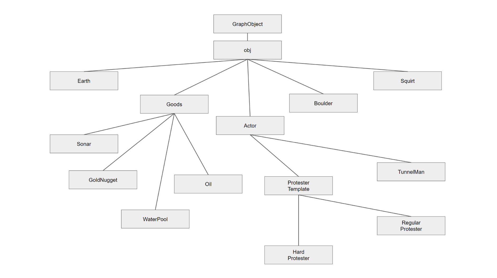

### C++ (Object-Oriented) Code Sample
---

#### Overview

This code sample is taken from one of my **academic** class projects - _TunnelMan game_

The objective was to implement a single-player graphical (2-D grid) game, given :-
  * an OpenGL/GLUT project code skeleton, with game-controller and asset files
  * intended game rules & logic that involved several computer controlled
actors that interacted with the player, and miscellaneous collectible objects.

##### Entity Diagram



### Files
```
.
├── Actor.cpp
├── Actor.h
|      • Captures all graphical objects
|      • _Characters_ (TunnelMan, Protestor, HardcoreProtestor)
|      • _Physical World_ (Earth, Boulder)
|      • _Collectibles_ (Gold, Water Gun, Oil Barrel, Sonar)
|
├── StudentWorld.cpp
└── StudentWorld.h
|      • Captures game logic, controller
|      • Distributes game objects within the 2-d grid
|      • Spawns characters based on game level, rules, etc
|          • e.g. Protestor, HardcoreProtestor
|      • Keeps track of player's score, lives, etc
```